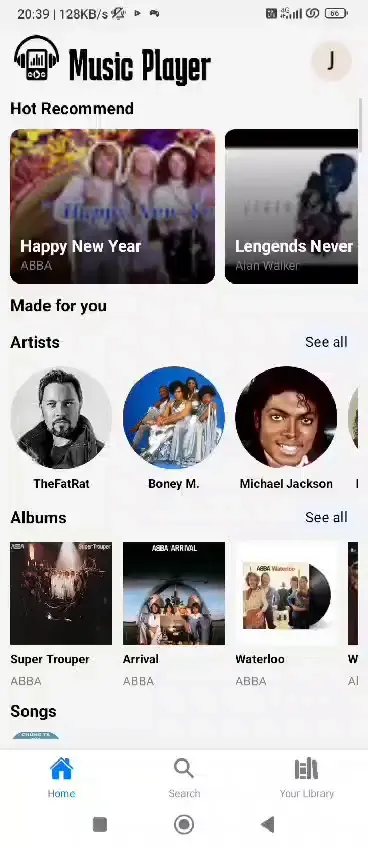

# **Music Player App** 🎶

Chào mừng bạn đến với **Music Player** - ứng dụng nghe nhạc được thiết kế đơn giản, tinh tế, và dễ dàng sử dụng. Với chất lượng âm thanh vượt trội, **Music Player** mang lại cho bạn những trải nghiệm âm nhạc tuyệt vời, mọi lúc, mọi nơi.

## 🚀 Tính Năng Chính

- **Giao diện trực quan**: Dễ dàng tìm kiếm, chọn và phát nhạc chỉ trong vài thao tác.
- **Chất lượng âm thanh**: Phát nhạc sắc nét, âm thanh rõ ràng, mang đến trải nghiệm nghe nhạc tuyệt hảo.
- **Dễ dàng quản lý playlist**: Thêm, xóa và sắp xếp các bài hát yêu thích chỉ với một vài cú nhấp chuột.
- **Chế độ phát ngẫu nhiên và lặp lại**: Tạo không gian âm nhạc theo cách bạn thích.

## 🎬 Xem Video Demo

Chưa rõ cách ứng dụng hoạt động? Đừng lo, dưới đây là ảnh động demo giúp bạn hình dung rõ hơn về trải nghiệm người dùng với **Music Player**:

## 🛠️ Hướng Dẫn Cài Đặt

1. **Tải ứng dụng**: Chỉ cần tải xuống và cài đặt trên thiết bị của bạn.
2. **Mở ứng dụng**: Sau khi cài đặt, mở ứng dụng và bắt đầu thưởng thức âm nhạc ngay lập tức.
3. **Thêm nhạc vào playlist**: Bạn có thể dễ dàng thêm nhạc từ thư viện vào danh sách phát.

---
